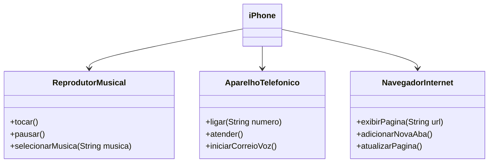

## Autores
- [Lucas Guedes]

## POO - Desafio

#### Contexto
Com base no vídeo de lançamento do iPhone de 2007 , elaborei a diagramação das classes e interfaces utilizando uma ferramenta UML de sua preferência. Em seguida, implementei as classes e interfaces no formato de arquivos `.java`.

### Objetivo
1. Criar um diagrama UML que represente as funcionalidades descritas acima.
2. Implementar as classes e interfaces correspondentes em Java (Opcional).

### Exemplo de Diagrama UML (Mermaid)

